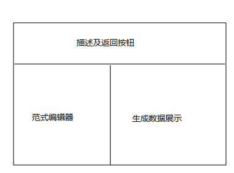
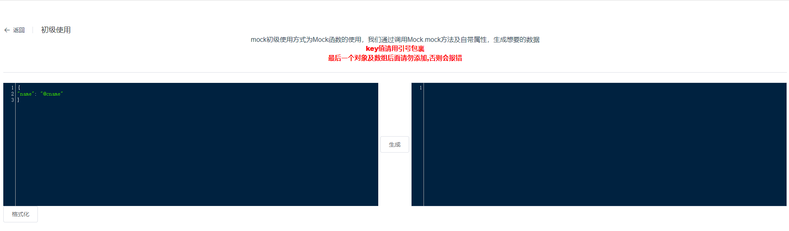
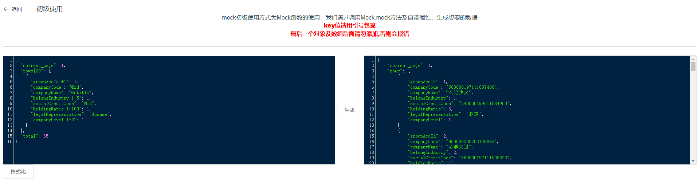
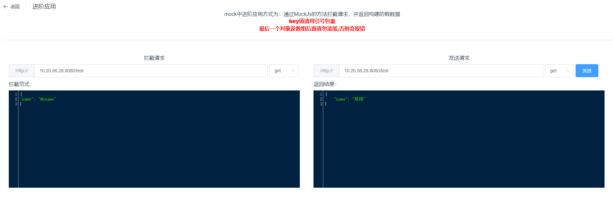

### 作者：放荡不羁的bug

# Mock.js

## 什么是Mock.js

在我们开发中，经常能碰见这样的问题：前端开发的进度快于后端接口的开发，这种情况之下，前端通常只能等待后端接口开发完毕或者依据后端提供的接口文档将数据在代码中写死，前者会浪费前端大量人力，而第二种会很麻烦（少量数据还勉强能造出来，但是需要较多的数据测试的话，尤其是造一些非文本类数据会特别麻烦），因此 `MockJs` 就是为了优化这一流程而出现的。


那 `MockJs` 到底是干什么的呢？

官网首页已经说的很清楚明了：生成随机数据，拦截 `Ajax` 请求。也就是说，它类似于代理工具，当前我们的代理工具有很多，基于浏览器插件的有 `Proxy SwitchOmega`，独立以软件存在的有 `Fiddler`  、`Rythem` 等，这些都能够满足上述的需求，那 `MockJs` 有什么优点呢？我们将会通过构建一个嵌入 `MockJs` 项目来一起了解这个工具。


## 规则了解

在实际操作之前，我们需要对 `MockJs` 数据生成规则做一些了解，整体来说，`MockJs` 整体生成数据的规则都是使用表达式模式，输入指定表达式，通过 `Mock.mock` 方法就可以生成相对应的数据。


表达式结构分为数据key、数据规则及基础数据三个模块，数据key代表生成数据后的key值，数据规则代表数据生成的规则，基础数据作用与生成规则有关，部分规则需要与基础数据结合共同表达，例如：`"string|3": "★★★"` 数据key为 `string` ，规则为生成 `★★★` 三次，最后生成结果为：`{string: "★★★★★★★★★"}` ，而如果规则不需要与基础数据结合共同表达，则基础数据的作用就剩下了表表明数据类型的作用，例如：`"number|1-100": 100` 此时我们需要生成一个 `1 - 100` 的数字，`100` 告诉的 `mock` 这个数据类型是`Number` 类型的，具体的数据规则如下：


常见数据类型操作有三种：分别是范围 `1-10` 、 递增 `+1` 、常量重复或对象随机抽取 `3` 

| 作用             | 范式                                | 示例                                                         | 生成数据                                                     |
| ---------------- | ----------------------------------- | ------------------------------------------------------------ | ------------------------------------------------------------ |
| 字符串随机重复   | key\|数字范围: 字符串               | "String\|1-10": "Mock "                                      | { String: 'Mock Mock Mock Mock Mock Mock ' }                 |
| 字符串重复       | key\|数字: 字符串                   | "String\|2": "Mock "                                         | { String: 'Mock Mock ' }                                     |
| 数字递增         | key\|+数字: 数字                    | 'rows\|2': [{'id\|+1': 0,}]                                  | [ {"id": 0},{"id": 1} ]                                      |
| 随机整数         | key\| 数字范围: 数字                | "number\|1-100": 100                                         | { "number": 64 }                                             |
| 随机非整数       | key\|数字范围.精确度范围: 数字      | "random\|1-100.1-10": 1                                      | { "random": 14.24846 }                                       |
| 随机布尔值       | key\|1: 布尔值                      | "boolean\|1": true                                           | { "boolean": false }                                         |
| 固定数量随机枚举 | key\|数字: 对象列表                 | "object\|1": {    "310000": "上海市",    "320000": "江苏省",    "330000": "浙江省"  } | "object": {  "310000": "上海市"  }                           |
| 随机数量随机枚举 | key\|数字范围: 对象列表             | "object\|1-3": {     "110000": "北京市",    "120000": "天津市",    "130000": "河北省"  } | "object": {    "120000": "天津市",    "130000": "河北省"  }  |
| 数组内随机取数据 | key\|数字: 数组                     | "array\|1": [    "AMD",    "CMD",    "UMD"  ]                | { "array": "AMD" }                                           |
| 数组内递增取数据 | key\|+数字: 数组                    | "array\|+1": [    "AMD",    "CMD",    "UMD"  ]               | {  "array": "UMD" }                                          |
| 随机长度数组     | key\|数字范围: 数组                 | 'array\|2-5': ['array']                                      | { “array”: ['array', 'array', 'array'] }                     |
| 随机长度对象数组 | key\|数字范围: 对象数组             | 'array\|2-5': [{'obj': 1}]                                   | { "array": [{obj: 1}, {obj: 1}] }                            |
| 函数处理         | {值定义, 处理函数定义}              | {  'foo': 'Syntax Demo',  <br />'name': **function**() {    **return** this.foo + 111  } } | {  "foo": "Syntax Demo",  "name": "Syntax Demo111" }         |
| 正则生成数据     | key: 正则                           | 'regexp': /\w\W\s\S\d\D/                                     | {  "regexp": "w@\rs2\|" }                                    |
| 变量使用         | {变量声明, @变量}                   | {"foo": "Hello",  "nested": {    "a": {      "b": {        "c": "Mock.js"      }    }  },  "absolutePath": "@/foo @/nested/a/b/c"} | {  "foo": "Hello", "nested": {"a": {"b": {"c": "Mock.js" }}},"absolutePath": "Hello Mock.js" } |
| 随机整数         | key: @integer( 最小, 最大 )         | random: '@integer(1, 9)'                                     | {random: 2}                                                  |
| 随机字符         | key: @character(字符描述)           | character: '@character("upper")'                             | {character: 'N'}                                             |
| 随机字符串       | key: @string(字符描述, 长度)        | string: '@string("lower", 5)'                                | {string: 'lvyki'}                                            |
| 范围内数字数组   | key: @range(开始值，结束值，跳跃值) | array: '@range(1, 10, 3)'                                    | { array: [1, 4, 7] }                                         |
| 随机日期         | key: @date(格式)                    | date: '@date("yyyyMMdd")'                                    | {date: '20030515'}                                           |

 

以下方法主要生成常见或者有固定规则的数据

| 作用           | 范式               | 示例                         | 生成数据                                         |
| -------------- | ------------------ | ---------------------------- | ------------------------------------------------ |
| 随机id         | @id                | id: '@id'                    | { id: "360000199504157347" }                     |
| 生成guid       | @guid              | guid: '@guid'                | { guid: "D2f1158d-B413-BF71-eFe9-52EBBbA7BAae" } |
| 全局自增长数字 | @increment(跨度)   | increment: '@increment(100)' | { increment: 103}                                |
| 图片生成连接   | Random.image()     | Random.image()               | 'http://dummyimage.com/240x400'                  |
| 图片base64     | Random.dataImage() | Random.dataImage()           |                                                  |
| 随机16进制颜色 | @color             | color: '@color'              | {color: '#f279a6'}                               |
| 大量英文文本   | @paragraph         | paragraph: ''@paragraph''    |                                                  |
| 大量中文文本   | @cparagraph        | cparagraph: ''@cparagraph''  |                                                  |
| 模拟域名       | @url               | url: ''@url'                 | { url: "http://ljjtwm.fi/bzxpdy" }               |
| 模拟email      | @email             | email: '@email'              | { email: "y.aikj@ped.mobi"}                      |
| 模拟IP地址     | @ip                | ip: '@ip'                    | { ip: "211.214.230.62"}                          |
| 模拟地域       | @region            | region: '@region'            | { region: "西北" }                               |
| 省份           | @province          | province: '@province'        | { province:  "广西壮族自治区" }                  |
| 市级           | @city(是否前缀)    | city: '@city(true)'          | { city: "上海 上海市" }                          |
| 县级           | @county(是否前缀)  | county: '@county(true)'      | { county: "广西壮族自治区 南宁市 良庆区" }       |


以下方法主要适合其他需求的工具

| 作用       | 范式              | 示例                                         | 生成数据                         |
| ---------- | ----------------- | -------------------------------------------- | -------------------------------- |
| 首字母大写 | @capitalize(英文) | hello: '@capitalize("hello")'                | { hello: "Hello" }               |
| 全部大写   | @upper(英文)      | upper: '@upper("hello")'                     | { upper: "HELLO" }               |
| 全部小写   | @lower(英文)      | hello: '@lower("HELLO")'                     | { hello: "hello" }               |
| 数组洗牌   | @shuffle(数组)    | array: '@shuffle(["a", "e", "i", "o", "u"])' | { array: ["e","i","a","u","o"] } |


## MockJs使用

首先，我们需要准备一套前端框架，在这里我使用脚手架生成一个 `vue` 框架，具体生成流程请参照 [Vue2.0 搭建Vue脚手架（vue-cli）](https://segmentfault.com/a/1190000011275993) 

项目使用 `element` 组件，需要提前配置，在此不做描述


**下面给出的例子都将上传至 `git`上，地址将在文章最后给出，大家如果需要源码可自取**  


安装 `mockjs` ：

```shell
npm install mockjs
```


后面涉及到代码编辑及 `ajax` 请求，所以安装一个代码编辑组件及 `axios` ：

```shell
npm install codemirror
npm install axios
```


### 初级使用：通过方法生成数据

首先我们要介绍的是 `mockjs` 的最基础用法：使用 `Mock.mock` 方式生成单条模拟数据，在接口文档确定的情况下，我们可以使用 `mockjs` 去模拟生成与文档预期相同的对象，这种使用方法适合表格类或信息展示类界面，能够快速轻便的生成符合预期的界面填充数据。


为了展示这个功能，我们搭建一个界面：首先，我们搭建一个界面，界面结构分为三块：头部展示描述信息、左侧放置可编辑 `mock` 范式的编辑器、右侧放置生成的数据。



架构代码如下：

```vue
<template>
  <div class="container">
    <el-page-header @back="goBack" content="初级使用">
    </el-page-header>
    <div class="title">mock初级使用方式为Mock函数的使用，我们通过调用Mock.mock方法及自带属性，生成想要的数据</div>
    <div class="title bold">key值请用引号包裹</div>
    <div class="title bold">最后一个对象及数组后面请勿添加,否则会报错</div>
    <el-divider></el-divider>
    <div class="box-container">
      <div class="code">
        <textarea ref="textarea"></textarea>
        <el-button class="format" @click="format">格式化</el-button>
      </div>
      <el-button class="button" @click="transfer">生成</el-button>
      <div class="reslut">
        <textarea ref="showText"></textarea>
      </div>
    </div>
  </div>
</template>

<style scoped lang="less">
.container {
  .title {
    text-align: center;
  }
  .bold {
    font-weight: 800;
    color: red;
  }
  span {
    margin: 0 auto;
  }
  .box-container {
    display: flex;
    align-items: center;
    div {
      height: 300px;
      display: inline-block;
    }
    .button {
      height: 40px;
      margin: 0 5px;
    }
    .code {
      flex: 1;
      width: 40%;
    }
    .operation {
      width: 15%;
    }
    .reslut {
      flex: 1;
      width: 40%;
      border: 1px solid #DCDFE6;
      overflow: auto;
    }
  }
}
</style>
```


引入 `codemirror` 代码展示器、 `mockjs` 、`axios` ：

```javascript
import _CodeMirror from 'codemirror'
// 核心样式
import 'codemirror/lib/codemirror.css'
// 引入主题后还需要在 options 中指定主题才会生效
import 'codemirror/theme/cobalt.css'
import 'codemirror/mode/javascript/javascript.js'
import Mock from 'mockjs'
// 尝试获取全局实例
const CodeMirror = window.CodeMirror || _CodeMirror
```


`mounted` 构建时初始化两个编辑器

```javascript
// 初始化编辑器实例，传入需要被实例化的文本域对象和默认配置
this.coder = CodeMirror.fromTextArea(this.$refs.textarea, this.options)
// 编辑器赋值
this.coder.setValue(this.code)
// 支持双向绑定
this.coder.on('change', (coder) => {
    this.code = coder.getValue()
})

// 初始化编辑器实例，传入需要被实例化的文本域对象和默认配置
this.coderShow = CodeMirror.fromTextArea(this.$refs.showText, {...this.options, readOnly: 'nocursor'})
```

此时界面如图所示：



左边编辑器为范式输入内容，点击生成可在右侧生成相应结果


生成功能就用到了我们的 `MockJs` 了，代码如下：

```javascript
transfer () {
  // 将所有单引号变为双引号，去除文本中的换行
  let codeDouble = this.code.replace(/'/g, '"')
  codeDouble = codeDouble.replace(/\/ +/g, '')
  codeDouble = codeDouble.replace(/[\r\n]/g, '')
  try {
    // 将文本转化为对象并使用Mock.mock生成结果
    let code = JSON.parse(codeDouble)
    this.resultCode = Mock.mock(code)
    // 将结果做多次转换之后放入展示编辑器内
    let resStr = JSON.stringify(this.resultCode)
    this.coderShow.setValue(JSON.stringify(JSON.parse(resStr), null, 4))
  } catch (error) {
    // 当解析失败时，弹出弹窗提示
    this.$message({
      message: '解析失败，请检查代码是否符合规范',
      type: 'warning'
    })
  }
},
```

在我们点击生成事件之后，去除左侧编辑器内内容并将其转化为较规范的字符串，再将其转化为可用于生成数据的对象，最后放入右侧的展示编辑器中（注：放入编辑器之前为什么要将数据在对象与字符串来回的转化，因为 `MockJs` 生成的数据是没有换行和缩进格式的数据，如果直接赋值，会导致生成的数据挤到一起，很不美观，所以我们通过这种方式将其展示标准化）


最后我们实现的效果如图所示：



### 进阶使用：拦截请求模拟数据

上面有讲到我们如何在开发时使用 `MockJs` 去生成需要的模拟数据，但是比较麻烦的事，这样生成代码模拟不出来请求返回的效果（因为请求是异步的，有可能会引起一些错误的交互逻辑），那有什么办法将数据模拟成请求的方式呢？


那么就得提到 `Mock.mock` 另一个使用方式了，那就是请求拦截，使用方式大致为：

```
Mock.mock(接口或正则, 请求类型, Mock范式)
```


为了表现其功能，我们通过例子的方法去展示其特性：

界面风格与上一个类似，我们左边设置需要拦截的请求，包括请求的 `url` 、请求方法以及模拟数据格式，右侧可以输入相应的请求，点击发送即可看到拦截返回的数据，话不多说，先上界面结构的代码：


```vue
<template>
  <div class="container">
    <el-page-header @back="goBack" content="进阶应用">
    </el-page-header>
    <div class="title">mock中进阶应用方式为：通过MockJs的方法拦截请求，并返回构建的假数据</div>
    <div class="title bold">key值请用引号包裹</div>
    <div class="title bold">最后一个对象及数组后面请勿添加,否则会报错</div>
    <el-divider></el-divider>
    <div class="container-body">
      <div class="box-container">
        <div class="title">拦截请求</div>
        <div class="show-box">
          <el-input class="url" placeholder="请输入拦截请求" v-model="interceptUrl" @change="interceptChange">
            <template slot="prepend">Http://</template>
          </el-input>
          <el-select class="method" v-model="interceptMethod" @change="interceptChange" placeholder="请选择">
            <el-option
              v-for="item in methodList"
              :key="item"
              :label="item"
              :value="item">
            </el-option>
          </el-select>
          <div class="body-title">拦截范式：</div>
          <textarea ref="interceptInput"></textarea>
        </div>
      </div>
      <div class="box-container">
        <div class="title">发送请求</div>
        <div class="show-box">
          <el-input class="url send-url" placeholder="请输入请求" v-model="sendUrl">
            <template slot="prepend">Http://</template>
          </el-input>
          <el-select class="method" v-model="sendMethod" placeholder="请选择">
            <el-option
              v-for="item in methodList"
              :key="item"
              :label="item"
              :value="item">
            </el-option>
          </el-select>
          <el-button type="primary" @click="send">发送</el-button>
          <div class="body-title">返回结果：</div>
          <textarea ref="resultInput"></textarea>
        </div>
      </div>
    </div>
  </div>
</template>
<style scoped lang="less">
.container {
  .title {
    text-align: center;
  }
  .bold {
    font-weight: 800;
    color: red;
  }
  .container-body {
    margin: 0 auto;
    .box-container {
      width: 47%;
      display: inline-block;
      padding: 1%;
      .show-box {
        padding-top: 10px;
        .url {
          width: 89%;
        }
        .method {
          width: 10%;
        }
        .body-title {
          margin: 10px 0px;
        }
        .send-url {
          width: 79%;
        }
        .send-button {
          width: 10%;
        }
      }
    }
  }
}
</style>
```


界面初始化流程就不多说了：

```javascript
import _CodeMirror from 'codemirror'
// 核心样式
import 'codemirror/lib/codemirror.css'
// 引入主题后还需要在 options 中指定主题才会生效
import 'codemirror/theme/cobalt.css'
import 'codemirror/mode/javascript/javascript.js'
import Mock from 'mockjs'
import axios from 'axios'

// 尝试获取全局实例
const CodeMirror = window.CodeMirror || _CodeMirror
```


初始化编辑器：

```javascript
// 初始化编辑器实例，传入需要被实例化的文本域对象和默认配置
this.interceptCoder = CodeMirror.fromTextArea(this.$refs.interceptInput, this.options)
// 编辑器赋值
this.interceptCoder.setValue(this.interceptCode)
// 支持双向绑定
this.interceptCoder.on('change', (coder) => {
  this.interceptCode = coder.getValue()
  // 每一次改变重新配置拦截
  this.interceptChange()
})

// 初始化编辑器实例，传入需要被实例化的文本域对象和默认配置
this.coderShow = CodeMirror.fromTextArea(this.$refs.resultInput, {...this.options, readOnly: 'nocursor'})
```


接下来是重点部分，设置拦截及请求发送

```javascript
// 设置拦截
interceptChange () {
  // 将所有单引号变为双引号，去除文本中的换行
  let codeDouble = this.interceptCode.replace(/'/g, '"')
  codeDouble = codeDouble.replace(/\/ +/g, '')
  codeDouble = codeDouble.replace(/[\r\n]/g, '')
  try {
    // 将文本转化为对象并使用Mock.mock拦截请求
    let code = JSON.parse(codeDouble)
    Mock.mock(this.interceptUrl, this.interceptMethod, code)
    this.isTrue = true
  } catch (error) {
    this.isTrue = false
  }
},
// 发送请求
send () {
  if (!this.isTrue) {
    this.$message({
      message: '范式解析失败，请检查范式是否符合规范',
      type: 'warning'
    })
  } else {
    axios[this.sendMethod](this.sendUrl, {}).then(res => {
      // 请求成功时，展示返回结果
      this.coderShow.setValue(JSON.stringify(res.data, null, 4))
    }).catch(error => {
      // 请求失败时，展示错误
      this.coderShow.setValue(JSON.stringify(error.message, null, 4))
    })
  }
}
```

最终结果如下：



当然，为了保障模拟更真实，我们可以设置延迟时间：

```javascript
Mock.setup({
  timeout: '200-600',
});
```


### 高阶使用：将拦截变为可配置项

通过上面的例子，我们可以使用 `MockJs` 去拦截并生成模拟数据，但是这种方法有几个缺点：

- 一个界面会有很多请求，界面中要写很多模拟相关的代码，导致前期代码过于臃肿
- 需要调试的时候，我们又要删除这些模拟数据代码，下次需要使用还得造
- 如果不小心把模拟数据代码残留下来，一旦发布出去界面功能将会失效

那么我们高阶使用要做的有以下几点：

- 模拟代码单独隔离
- 代码可重复使用
- 模拟功能可开关
- 模拟代码只在开发阶段生效

我们的设计如下：我们将拦截信息设置为可配置的对象，将接口信息（请求方式|接口名称）作为 `key` 值，`mock` 范式作为 `value` 值，结构如下：

```javascript
'post|/demo': {
    'name': '@cname'
}
```

在项目初始化的时候我们获取所有的配置项，并通过 `Mock.mock` 方法添加拦截，这样的话我们就做到了第一和第二两个特点：在开发界面没有多余代码，代码可重复使用，其实现方式如下：

```javascript
// 代码结构：
// - mockjs
//   - demo
//   - demo.js
//   - index.js
// 使用Webpack的require.context()遍历所有mock文件
const files = require.context('.', true, /\.js$/)
files.keys().forEach((key) => {
  // 剔除配置文件
  if (key === './index.js') {
    return
  }
  // 将所有配置文件的对象放入数组中
  configArray = configArray.concat(files(key).default)
})

// 注册所有的mock服务
configArray.forEach((item) => {
  for (const [path, target] of Object.entries(item)) {
    // 将key拆解为请求方式及拦截路径，并添加拦截
    const protocol = path.split('|')
    Mock.mock(new RegExp('^' + config.rootPath + protocol[1]), protocol[0], target)
  }
})
```


第三个特点的实现也比较简单，我们添加一个配置文件 `mock.config.js` 其中添加开关配置项 `enableMock` ，在上述代码中添加一个判断语句，根据是否打开开关决定是否解析并拦截请求。


那怎么做到只在生产环境生效呢？我们项目初始化后为了区分生产环境与开发环境，在`config` 文件夹下放置了两个区分文件，分别是 `dev.env.js` 与 `prod.env.js` ，在文件中定义了不同的 `NODE_ENV` 参数，当我们使用 `npm run dev` 命令时，系统读取 `dev.env.js` 代码，此时系统变量 `process.env.NODE_ENV === ‘development’` 如果我们使用 `npm run build` 时 `process.env.NODE_ENV === ‘production’` ，我们通过这个变量判断当前环境是否处于开发环境，然后在程序入口 `main.js` 中添加启动 `mockjs` 解析语句：

```javascript
if (process.env.NODE_ENV === 'development') {
  require('./mockjs/index')
}
```

这样一来我们即使在打包时忘了关闭 `mock` 的开关，也不会影响到生产环境的接口调用，在这里我门也做了一个例子，具体代码就不展示了，大家想看的话可以去我的 `git` 下拉取代码，最后界面如下：


## 总结

对于 `mockjs` 的使用，是针对着一些常见的开发现象的，在开发时，我们经常会遇到这种情况：前端早早的开发完毕，但是后端由于业务复杂，暂时提供不了数据，导致前端无法做一些操作代码正确性验证，但是通过 `mockjs` 我们就不必再拘泥于后端数据，我们根据后端提供的接口文档，就可以配置模拟出想要的数据，这样我们在假的环境里能够完整的调试我们的界面逻辑，能够非常大的减少联调周期。其次我们有时对于现场的特殊数据导致的前端问题，而后端构建数据困难时，我们也可以使用 `mockjs` 去模拟这些数据，达到模拟现场环境的效果。


git地址：https://github.com/shiyingjieGra/mockJsWeb

