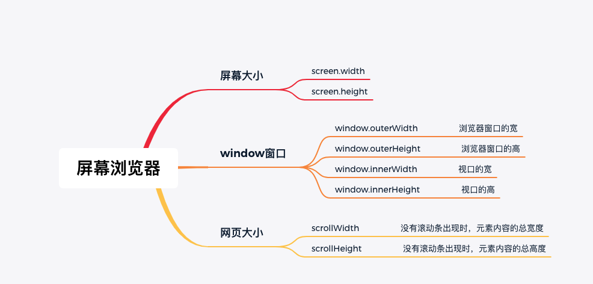
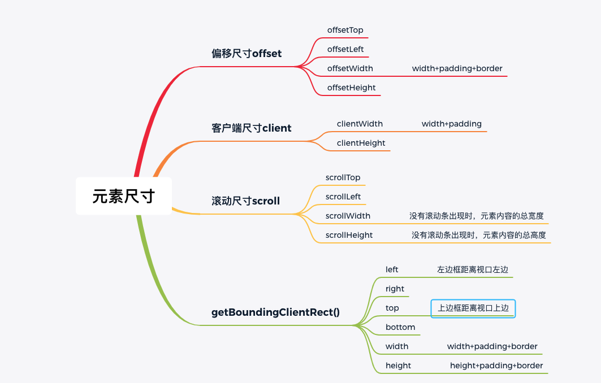

# 响应式设计：适应不同屏幕尺寸和设备的用户界面

## 设备像素、逻辑像素

1. 设备像素（Device Pixels）：  
   - 设备像素是硬件上的物理像素，它们构成了显示设备的实际分辨率。
   - 设备像素决定了屏幕的清晰度和精度，通常以像素（px）为单位来表示。
   - 例如，一个1920x1080分辨率的显示屏有1920个水平像素和1080个垂直像素，这些都是设备像素。
2. 逻辑像素（Logical Pixels）：  
   - 逻辑像素是相对于设备像素的抽象单位，用于网页开发和移动应用开发中，以便在不同屏幕尺寸和分辨率上保持一致的布局和外观。
   - 逻辑像素是用于测量和定义元素的尺寸和位置的虚拟像素。
   - 一个逻辑像素通常等于一个设备像素，但在高DPI（高像素密度）屏幕上，一个逻辑像素可能映射到多个设备像素，以提供更高的清晰度。

逻辑像素的概念允许开发人员创建响应式设计，使网页和应用在不同的屏幕上都能够良好呈现，而不受设备分辨率的影响。通过使用逻辑像素，开发人员可以更容易地管理元素的大小和位置，以确保它们在各种设备上都具有一致的用户体验。


## viewport视口

Viewport是指用户在屏幕上看到的<font color=#4357AD>可见区域</font>，而视口元标签和响应式设计技术允许开发人员控制和优化网页在不同设备上的呈现方式，以提供最佳的用户体验。  

移动端禁止可见区域缩放：  

```html
<meta name="viewport" content="width=device-width, initial-scale=1.0, maximum-scale=1.0, user-scalable=no">
```

width: 设置Viewport的宽度，可以使用特定的像素值（例如width=500px）或特定的单位（例如width=device-width表示设备宽度）。  
height: 设置Viewport的高度，可以使用特定的像素值或特定的单位。   
initial-scale: 设置初始缩放比例。  
minimum-scale: 设置最小缩放比例。  
maximum-scale: 设置最大缩放比例。  
user-scalable: 控制用户是否能够手动缩放网页，可以设置为yes或no。  

PC端网页通常采用固定布局，其中元素的宽度和位置相对于浏览器窗口是固定的。这意味着网页在不同大小的屏幕上可能会出现滚动条，但通常不需要进行缩放  

  

## 常见的屏幕有哪些以及得到的对应的设计稿

常见的屏幕大小包括：  
设计师给的设计稿是物理分辨率，会是我们写样式的逻辑分辨率的两倍。  
**手机设备**：包括智能手机和小型平板电脑等移动设备。典型的视口宽度范围可以是<font color=#C1666B>320px到768px</font>之间。设计稿<font color=#48A9A6>750x1334</font>（一般使用二倍图设计稿）。  
**平板设备**：包括中型和大型平板电脑。典型的视口宽度范围可以是<font color=#C1666B>768px到1024px</font>之间。使用768x1024这个尺寸作图，然后输出2倍图<font color=#48A9A6>1536x2048</font>，即可输出iPad mini和iPad的设计稿。  
**桌面设备**：包括台式机和笔记本电脑等大屏幕设备。典型的视口宽度范围可以是<font color=#C1666B>1024px</font>以上。使用<font color=#48A9A6>1920x1080(最常用)或者1366x768</font>。随着高分辨率显示器的普及，一些设计师也倾向于采用更大的设计稿尺寸，以提供更高质量和更丰富的视觉体验。  


### 如何查询屏幕大小

  


另外，需要注意的是，这些方法获取的是当前窗口或文档的大小。如果需要实时监测屏幕大小的变化，可以使用window对象的resize事件监听器来捕获窗口调整大小的事件。  
```js
window.addEventListener('resize', function() {
  // 在这里处理屏幕大小变化的逻辑
});
```


## 如何自适应

1. 媒体查询（Media Queries）：使用CSS的媒体查询可以根据设备的屏幕尺寸和特性来应用不同的CSS样式。通过设置不同的CSS规则，可以为不同的屏幕宽度范围定义不同的样式，从而实现页面的自适应。  

2. 弹性布局（Flexbox）：使用CSS的弹性布局可以方便地创建灵活的、响应式的布局。通过设置容器和项目的弹性属性，可以自动调整布局以适应不同屏幕尺寸。  

3. REM（相对单位）：使用REM单位可以根据根元素（通常是html）的字体大小来相对地定义其他元素的大小。通过设置根元素的字体大小，并使用REM单位来定义其他元素的大小，可以实现根据屏幕尺寸自适应调整元素大小。  

4. 使用vw、vh和百分比  

注意如果使用强制缩放，会导致图片文字失真模糊。  

#### 媒体查询

```css
@media mediaType and (mediaFeature) {
  /* CSS样式规则 */
}
```

其中，mediaType表示媒体类型，可以是all（所有设备）、screen（屏幕设备）、print（打印设备）等。mediaFeature表示媒体特性，例如设备宽度、设备高度、屏幕方向等。  
以下是一些常见的媒体特性，用于根据设备的屏幕尺寸应用不同的CSS样式：  
width：设备宽度  
height：设备高度  
orientation：屏幕方向（横向或纵向）  
min-width：最小宽度  
max-width：最大宽度  
min-height：最小高度  
max-height：最大高度  
aspect-ratio：宽高比  
device-pixel-ratio：设备像素比  
下面是一个示例，演示如何使用媒体查询根据设备宽度应用不同的样式：  

```css
/* 当设备宽度小于等于600px时应用以下样式*/
@media screen and (max-width: 600px) {
  /* CSS样式规则 */
}

/* 当设备宽度大于600px且小于等于1200px时应用以下样式 */
@media screen and (min-width: 601px) and (max-width: 1200px) {
  /* CSS样式规则 */
}

/* 当设备宽度大于1200px时应用以下样式 */
@media screen and (min-width: 1201px) {
  /* CSS样式规则 */
}
```


#### 弹性布局

弹性容器（Flex Container）的属性：  
display: flex;：将容器设置为弹性容器。  
flex-direction：指定主轴的方向（水平或垂直）。  
justify-content：控制主轴上的元素对齐方式。  
align-items：控制交叉轴上的元素对齐方式。  
flex-wrap：指定元素是否换行以及换行的方式。  
弹性项目（Flex Items）的属性：  
flex-grow：定义元素在剩余空间中的放大比例。  
flex-shrink：定义元素在空间不足时的缩小比例。  
flex-basis：定义元素在分配多余空间之前的初始大小。  
flex：缩写属性，包括flex-grow、flex-shrink和flex-basis的值。  
align-self：控制单个元素在交叉轴上的对齐方式。  


#### REM（相对单位）

原理：css3规定：1rem的大小就是根元素html的font-size的值。  
rem在桌面浏览器上的初始值是16px（即1rem = 16px）。  
淘宝手机端：  大名鼎鼎的Flexible  


## 实践

pc端响应式设计：  

不适合使用vw，因为我们会有横向滚动条；使用media screen+flex，限制最小为1280px。   

```css
html{
  min-width:1280px;
}

.title {
    font-size: 50px;
 } 


@media screen and (min-width: 1440px){
 .title {
    font-size: 60px;
 }  
}

```


移动端响应式设计：   
由于viewport单位得到众多浏览器的兼容，lib-flexible这个过渡方案已经可以放弃使用，不管是现在的版本还是以前的版本，都存有一定的问题。建议大家开始使用viewport来替代此方法。  

Vue移动端适配解决方案：  
postcss-px-to-viewport：https://juejin.cn/post/7018433228591595550  
移动端适配：https://juejin.cn/post/7084926646033055752  
兼容vant：https://juejin.cn/post/6844904146865225742

